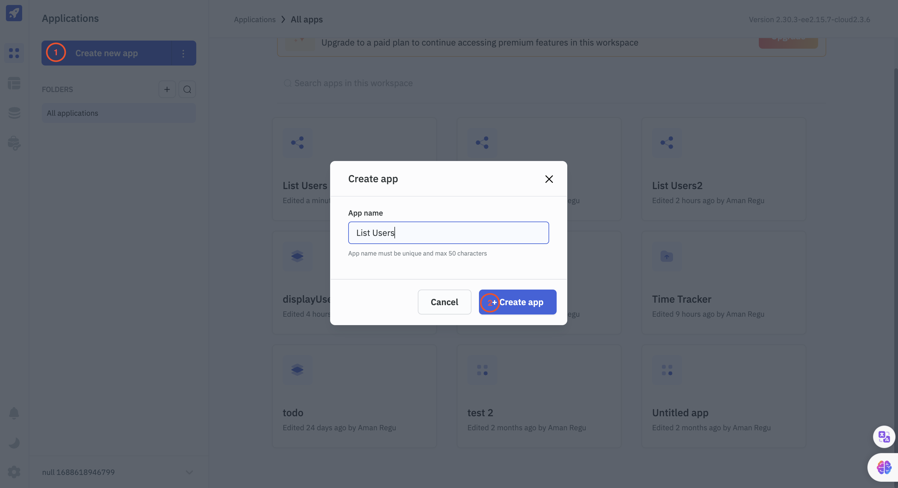
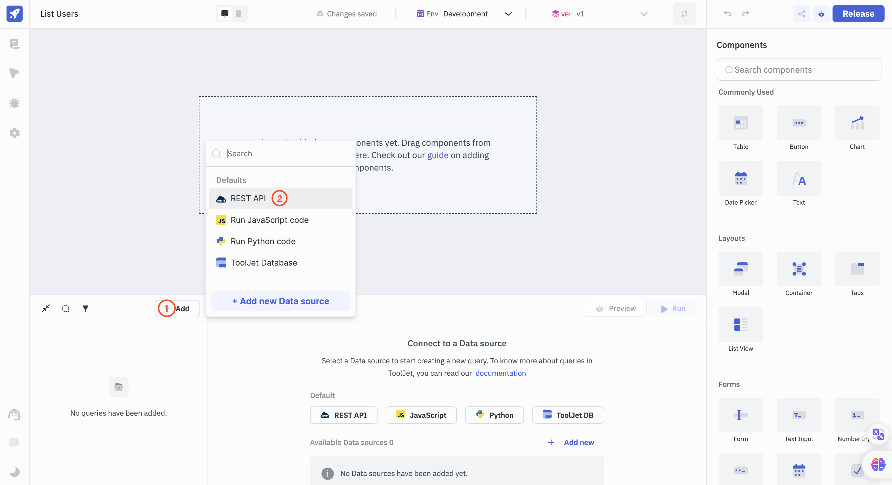
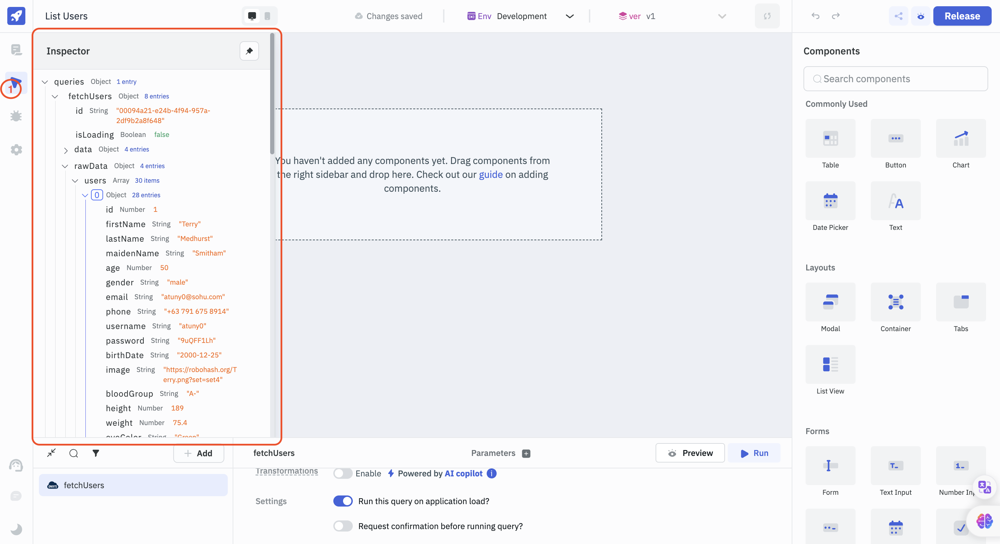
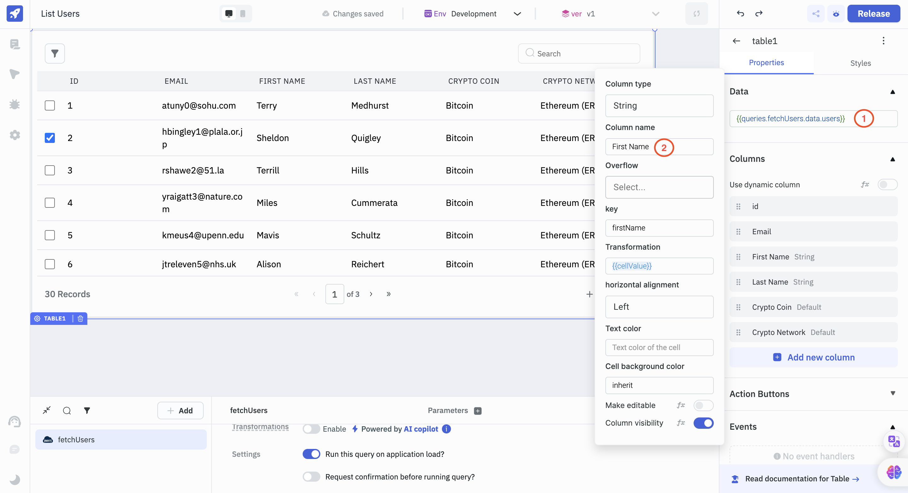
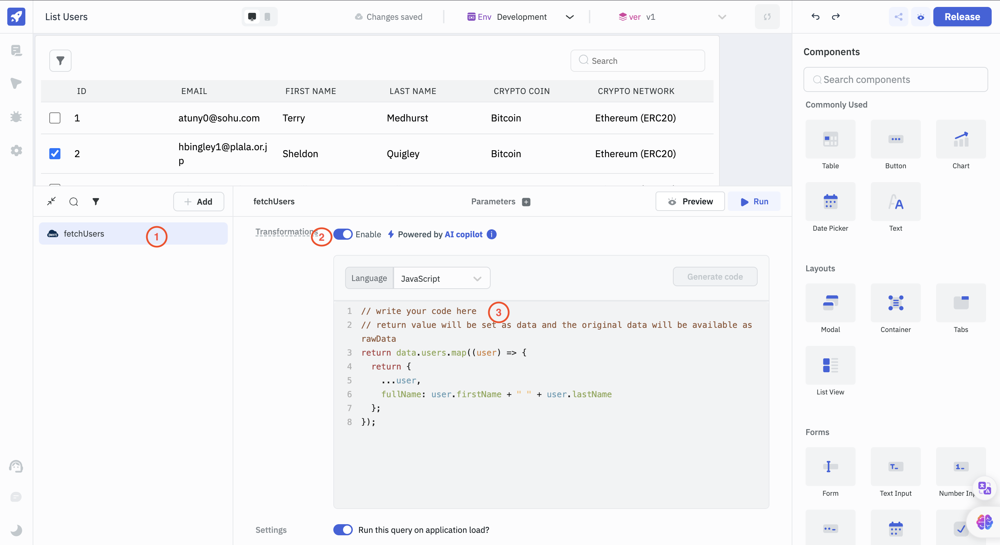
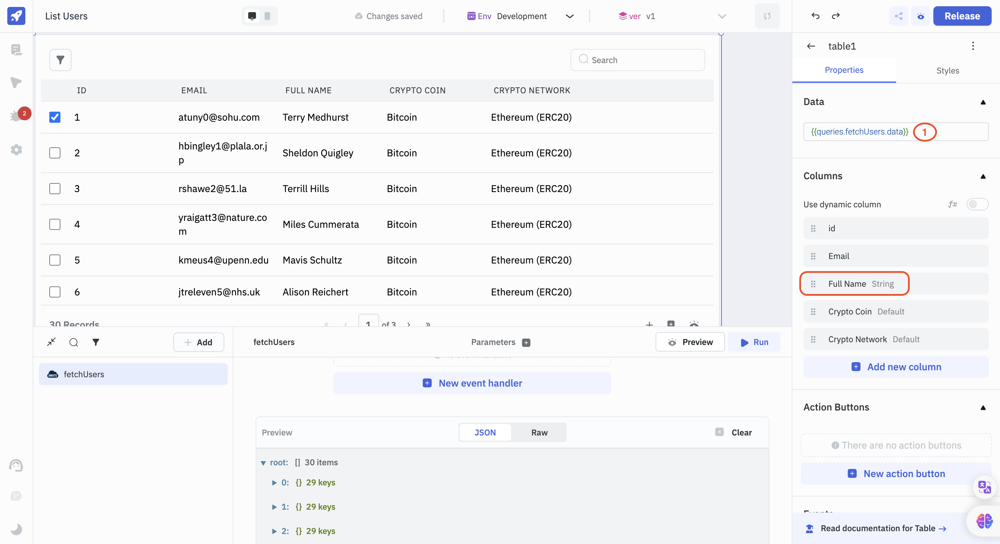

# A Quick Guide for Connecting and Visualizing Data Sources with ToolJet

This guide aims to help both beginner and intermediate users of **ToolJet** seamlessly connect to a data source, retrieve and transform the desired data, and visualize it with the components available within **ToolJet**. We'll cover the essential steps in a straightforward manner.

## Introduction

**ToolJet** is an open-source, low-code framework designed to  build and deploy custom internal tools. It has a intuitive drag-and-drop builder and library of 45+ pre-built components. It integrates with popular data sources and APIs, then execute queries to fetch and manipulate data. The data fetched from data sources can be transformed or modified using javascript and then visualised using the UI components such as tables, charts, forms, etc.
In this guide, we'll build a simple application that uses a dummy REST endpoint to fetch the data. Once we fetch the data, we'd transform it using JavaScript into something that we'd want and then visualise the transformed data into a table. While covering these steps, we'd also get a clear idea of the fundamentals of ToolJet and how to get started with building simple tools with it.
For this tutorial, we will use [**ToolJet Cloud**](https://www.tooljet.com/). Sign up at [**tooljet.com/signup**](https://www.tooljet.com/signup) if you don't have an account with ToolJet already.

## Setup

To create a new application in ToolJet, first, go to the
[**ToolJet Dashboard**](https://app.tooljet.com/) and look for the `Create new app` button in the top left corner. When you click on it, you will be prompted to enter the App name. Let's name the app `List Users`. Please note that the app name should be unique and must not exceed 50 characters. Once you have entered the name, click on the `+ Create App` button. This will create a new application with an empty canvas, and you will be ready to get started.



## Connecting to a Data Source

In this tutorial, we will be utilizing a REST API endpoint as our data source. ToolJet enables us to connect with any REST API endpoint that is available and create queries and transformations to interact with it. To showcase this functionality, we will be using a service called DummyJSON, which will provide us with a REST API containing fake JSON data that we can transform and visualize.

To connect to the dummyJSON REST API data source, you need to navigate to the query panel at the bottom of the app builder. From there, click the `+ Add` button to open the dropdown with the list of available Data Sources and select `REST API`. Then, name this query as `fetchUsers`. For simplicity, we'll be using an unauthenticated API endpoint, which means we won't have to enter the parameters required for authenticated requests.



In the URL field, enter `https://dummyjson.com/users` as the URL. Scroll down to the `Settings` section and turn on the toggle for `Run this query on application load?` This will ensure that the query runs every time we start/restart the application. You can leave the rest of the fields and toggles untouched. You can now preview the query results by clicking the `Preview` button.


### Expected JSON preview

```  
{
  "users": [
    {
      "id": 1,
      "firstName": "Terry",
      "lastName": "Medhurst",
      "maidenName": "Smitham",
      "age": 50,
      "gender": "male",
      "email": "atuny0@sohu.com",
      "phone": "+63 791 675 8914",
      "username": "atuny0",
      "password": "9uQFF1Lh",
      "birthDate": "2000-12-25",
      "image": "https://robohash.org/Terry.png?set=set4",
      "bloodGroup": "A-",
      "height": 189,
      "weight": 75.4,
      "eyeColor": "Green",
      "hair": {
        "color": "Black",
        "type": "Strands"
      },
      "domain": "slashdot.org",
      "ip": "117.29.86.254",
      "address": {
        "address": "1745 T Street Southeast",
        "city": "Washington",
        "coordinates": {
          "lat": 38.867033,
          "lng": -76.979235
        },
        "postalCode": "20020",
        "state": "DC"
      },
      "macAddress": "13:69:BA:56:A3:74",
      "university": "Capitol University",
      "bank": {
        "cardExpire": "06/22",
        "cardNumber": "50380955204220685",
        "cardType": "maestro",
        "currency": "Peso",
        "iban": "NO17 0695 2754 967"
      },
      "company": {
        "address": {
          "address": "629 Debbie Drive",
          "city": "Nashville",
          "coordinates": {
            "lat": 36.208114,
            "lng": -86.58621199999999
          },
          "postalCode": "37076",
          "state": "TN"
        },
        "department": "Marketing",
        "name": "Blanda-O'Keefe",
        "title": "Help Desk Operator"
      },
      "ein": "20-9487066",
      "ssn": "661-64-2976",
      "userAgent": "Mozilla/5.0 (Windows NT 6.1) AppleWebKit/534.24 (KHTML, like Gecko) Chrome/12.0.702.0 Safari/534.24",
      "crypto": {
        "coin": "Bitcoin",
        "wallet": "0xb9fc2fe63b2a6c003f1c324c3bfa53259162181a",
        "network": "Ethereum (ERC20)"
      }
    }
  ],
  "total": 100,
  "skip": 0,
  "limit": 30
}
  
```

## Retrieve the data

To access the query results within the components, we can use `{{queries.<queryname>.data}}`. Whenever we need to write custom JavaScript code or access variables that are available within the app builder, we have to use double curly braces `{{}}`. We can also use the inspector available in the left sidebar to check all the available query results and other accessible variables.



## Adding Data to a Table Component

We have created a query to fetch data for our users. To display this data in a table, we need to drag the Table component from the right sidebar onto the canvas. The table size can be adjusted as per our requirements, and we can customise it using the input fields in the right sidebar. Rename the table from 'table1' to 'userTable'. Currently, the table displays mock data, which can be replaced with the query result we obtained from `fetchQuery`. Replace the JSON data with `{{queries.fetchUsers.data.users}}`. This will let ToolJet to create columns automatically based on the data received. The Table component on the canvas should populate with this data by itself. To keep our table simple and concise, we will delete all the columns except for `id`, `email`, `firstName`, `lastName`, `crypto.coin`, and `crypto.network`.
We can adjust the parameters for individual columns by clicking on the column name in the right sidebar. The column names were automatically generated based on the data value keys. Update them to improve the table's appearance.




## Transforming the data using JavaScript

Suppose we want to display the full name of the user in a single column instead of having separate columns for First Name and Last Name. However, when we check the JSON preview of the data obtained from the fetchUsers query, we notice that there is no key or value for the full name. This is where ToolJet's Transformations come in. It enables us to modify the query results using custom Python or JavaScript. In this tutorial, we will be using JavaScript as an example.
Our fetchUsers query returns user data containing first and last name. We will use Transformations to merge these values to create the Full Name column.
Select the query fetchUsers from the query panel. Enable the toggle for Transformations. Once we enable the toggle, we'd see a code editor downdrop. This is where we can place our custom JavaScript code. Make sure in the language dropdown, JavaScript is selected. Place the code below into the code editor.
```
return data.users.map((user) => {
  return {
    ...user,
    fullName: user.firstName + " " + user.lastName
  };
});
```


We have successfully added a key-value pair to our user object. It's important to note that we have transformed the data, so it will now be available as `{{queries.fetchUsers.data}}` instead of `{{queries.fetchUsers.data.users}}` in our components. Let's update the data parameter of our Table component to reflect this change. 
To do this, go to the properties of the Table component and change the data value from `{{queries.fetchUsers.data.users}}` to `{{queries.fetchUsers.data}}`. 
Additionally, since we have added a column for the full name, we should remove the columns for the first and last names.



That's all. Click on the Release button located at the top right corner to publish your ToolJet app.

# Conclusion

This straightforward guide demonstrates how easy it is to use ToolJet for data integration and visualization. We achieved the following:

-   **Connected to a data source:**  We successfully integrated the DummyJSON REST API as our data source. ToolJet's flexibility makes it possible to connect to various other data sources like databases, cloud storage, and more.
-   **Retrieved and transformed data:**  We used a simple REST API query to fetch JSON data. Then, we used ToolJet's Transformations feature to modify the fetched data using JavaScript, adding a new column for the full names.
-   **Visualized the data:**  Using ToolJet's drag-and-drop interface, we displayed the transformed data in a customizable table component, selectively choosing which columns were most relevant.

This tutorial is a stepping stone to building more complex applications with ToolJet. Its low-code approach makes it ideal for:

-   **Rapid Prototyping:**  Quickly visualize how an application may work and how the data interactions might flow.
-   **Building Internal Tools:**  Streamline business processes by creating internal dashboards, reporting systems, or custom admin interfaces.


